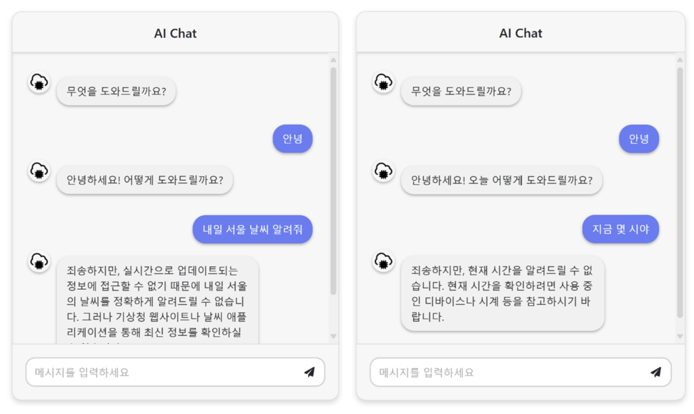

# Custom-Ai-Chatbot

## 프로젝트 개요

이 프로젝트는 사용자가 질문을 입력하면 실시간으로 답변을 제공하는 간단하고 직관적인 채팅 서비스입니다.  
OpenAI API를 활용하여 자연어 처리 기반 응답을 생성하며, PubSub와 WebSocket을 통해 실시간 통신을 지원합니다.

---

## 주요 기능

1. **질문 처리**
   - 사용자가 전송한 질문을 처리 대기열에 추가하고 OpenAI API(GPT-4o)를 호출하여 답변을 생성합니다.   
   - 질문과 응답 데이터를 MongoDB에 저장하여 기록 관리와 분석이 가능합니다.

2. **실시간 채팅**
   - PubSub 토큰과 WebSocket을 사용하여 실시간으로 메시지를 주고받습니다.
   - 사용자와의 빠르고 원활한 대화를 지원합니다.

3. **정보 제공**
   - 다양한 주제에 대한 설명과 정보를 제공합니다.
   - 일상적인 지식부터 기술적인 주제까지 폭넓은 정보를 전달합니다.

4. **창작 지원**
   - 글쓰기 아이디어, 이야기 초안, 또는 특정 주제에 대한 창작물을 제공합니다.
   - 창의적인 작업을 위한 아이디어 제안도 가능합니다.

5. **간단한 수식 계산**
   - 예: 1 + 1, 3 * 7 등 간단한 산술 연산을 수행합니다.
   - 계산 요청에 대해 즉각적인 결과를 제공합니다.

---

## 채팅 인터페이스

<https://rimchatbotstorage.blob.core.windows.net/data/front.html>

---

## 제한 사항

1. **기억 기능 제한**
   - 이전 대화를 지속적으로 기억하지 못합니다.
   - 대화가 종료되면 새로운 대화에서 이전의 문맥이나 내용을 참조할 수 없습니다.

2. **개인화된 서비스 제공 불가**
   - 개인 맞춤형 답변이나 특정 상황에 맞는 고도화된 지원은 어렵습니다.
   - 사용자가 제공한 정보를 기반으로 일반적인 범위 내에서 답변을 제공합니다.

3. **외부 데이터 기반 질문 미지원**
   - 날씨, 시간, 위치 등 외부 API 연동이 필요한 질문을 처리할 수 없습니다.
   - 실시간 데이터 기반 응답은 제공하지 않습니다.

4. **다국어 지원 미제공**
   - 현재 한국어로 작성된 질문과 답변만 지원합니다.
   - 다른 언어에 대한 질문은 처리할 수 없습니다.

5. **복잡한 계산 미지원**
   - 고난도의 수학적 문제나 복잡한 연산은 처리할 수 없습니다.
   - 간단한 수식 계산만 지원합니다.

---

## 향후 구현 목표

이 프로젝트는 현재의 기능을 확장하여 더 다양한 사용자 요구를 충족하기 위해 다음과 같은 기능을 추가적으로 구현할 계획입니다:

1. **동적 정보 검색 기능**
   - OpenAI와 외부 API를 결합하여 실시간 검색 및 동적 데이터 응답 지원.
   - 학습되지 않은 새로운 정보에 기반한 실시간 응답 생성.

2. **고급 문맥 인식**
   - 대화의 문맥을 더욱 정확히 이해하도록 개선.

3. **다국어 지원**
   - 자동 언어 감지를 포함한 다국어 대화 지원.

4. **DALL-E 기반 이미지 생성 및 수정**
   - 사용자의 텍스트 프롬프트를 기반으로 OpenAI DALL-E API를 이용하여 이미지를 생성.
   - 이미지의 일부를 수정하거나 보완하는 기능 제공.

5. **PDF 문서 요약 및 번역 서비스**
   - PDF 문서를 업로드하면 문서 내용을 요약하고 여러 언어로 번역하는 기능 제공.

---

## 기술 스택

- **프론트엔드**
  - HTML, CSS (Bootstrap)
  - JavaScript (jQuery)

- **백엔드**
  - Python (FastAPI)

- **기타**
  - OpenAI API (GPT-4o)
  - MongoDB (데이터 저장)

---

## 라이선스

이 프로젝트는 **MIT License**를 따릅니다. 자세한 내용은 `LICENSE` 파일을 참조하세요.
